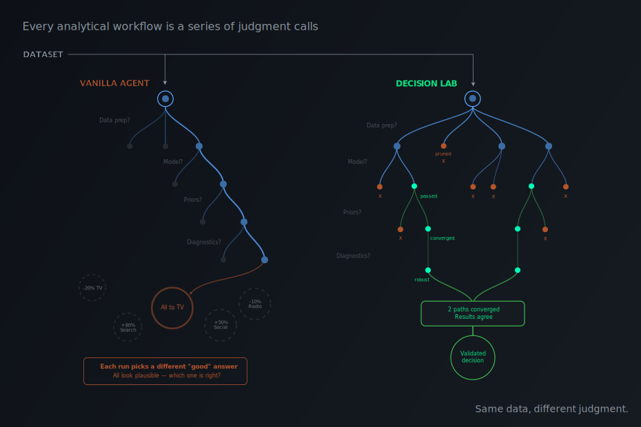

# decision-lab

A harness for agentic data science.

Coding agents write good code. They make bad analytical decisions. decision-lab gives you the tools to fix the second part.

decision-lab runs your analysis multiple ways — different models, different assumptions — and checks whether they converge. If they converge on the same answer, you can trust it. If they don't, it tells you what it doesn't know and what experiments would resolve the uncertainty. You package the prompts, domain skills, and environment into a **decision-pack**, point it at your data, and get back reports, figures, and recommendations that hold up to scrutiny.

<!-- demo gif here -->

<!-- TODO: Architecture diagram — orchestrator → parallel subagents → consolidator.
     Show: (1) single prompt + dataset enter the orchestrator,
     (2) fan-out to N parallel subagents, each with a different modeling approach,
     (3) consolidator compares results, produces one report with convergence/divergence assessment.
     Three stages, left to right. Keep it minimal. -->

## Why

There are many ways to analyze a dataset. Most of them are wrong. An unsupervised agent picks one path through the analytical space and commits to it. If that path happens to be wrong, you get a nice-looking report with bad conclusions. Nobody notices for months.

We [tested this on marketing mix modeling](https://www.youtube.com/watch?v=ess4qV8JKQc). We gave vanilla Claude Code and our [MMM agent](decision-packs/mmm/) the same adversarial dataset where no valid inference was possible. Claude Code fit a model and recommended budget reallocations. Our agent tried 11 approaches, found that none of the models converged, said so, and recommended experiments to collect better data.

decision-lab (`dlab`) is the framework we built to make agents behave like that.



## How it works

You package everything an agent needs into a **decision-pack**: agent prompts, domain skills, tools, and a locked environment. The agent explores multiple approaches instead of committing to the first one that runs, and consolidates the results into a report.

**Skills** constrain the agent to methodologically sound paths — mandatory diagnostics, preferred model structures, sensible defaults. Browse and install validated data science skills from [Decision Hub](https://github.com/pymc-labs/decision-hub).

**Parallel subagents** fan out with different approaches to the same problem (different data prep, different model structures). If results converge across approaches, you have evidence the conclusions are robust. If they diverge, the agent flags the disagreement and identifies what drives it. Supports running compute-heavy tasks on [Modal](https://modal.com).

**Locked environments.** Reproducibility matters. Library APIs change constantly, LLMs are trained on old versions, and skills are tuned to specific packages. decision-packs lock dependencies so the agent codes against the right API every time. By default, sessions run in a Docker container with pinned dependencies. Don't want Docker? The agent will set up the environment locally before running.

Domain expertise is loaded through **decision-packs** — pluggable configurations that specialize the agent for a specific analytical domain. The first decision-pack targets [Bayesian marketing mix modeling](decision-packs/mmm/). Finance, forecasting, and other domains can be added by writing a new pack.

## Install

**Requires [Docker](https://docs.docker.com/get-docker/)** and Python 3.10+

```bash
pip install dlab-cli
```

## Quick start

```bash
echo "ANTHROPIC_API_KEY=your-key-here" >> .env

# Run the MMM decision-pack on the included example dataset
dlab --dpack decision-packs/mmm \
  --data decision-packs/mmm/example-data/example_dataset.csv \
  --env-file .env \
  --work-dir ./mmm-run \
  --prompt "Analyze our marketing spend and recommend budget allocation"

# Watch it work
dlab connect ./mmm-run
```

Or build your own decision-pack. Ask Claude to scaffold one for you:

```bash
dhub install pymc-labs/decision-lab
claude
# > "Create a decision-pack for time series forecasting with statsforecast"
```

## What's a decision-pack?

A directory with everything an agent needs: system prompts, domain skills, tools, a locked environment, and permissions.

```
my-dpack/
  config.yaml           # Name, model, hooks
  docker/
    Dockerfile          # Locked environment
    requirements.txt    # Pinned dependencies
  opencode/
    opencode.json       # Permissions
    agents/
      orchestrator.md   # Main agent system prompt
    tools/              # Custom tools
    skills/             # Domain knowledge
    parallel_agents/    # Fan-out configs
```

See the [poem decision-pack](decision-packs/poem/) for a fully annotated example showing how all the pieces connect. Here's what happens when you run it:

```bash
dlab --dpack decision-packs/poem --env-file .env --prompt "Write me a poem about the ocean"
```

1. dlab builds the Docker image from [`docker/Dockerfile`](decision-packs/poem/docker/Dockerfile) (cached after first run)
2. The pre-run hook [`say_hi.sh`](decision-packs/poem/say_hi.sh) runs inside the container
3. The orchestrator ([`literary-agent.md`](decision-packs/poem/opencode/agents/literary-agent.md)) starts and calls the terrible poet ([`popo-poet.md`](decision-packs/poem/opencode/agents/popo-poet.md)) via the `task` tool
4. The orchestrator reads the terrible poet's attempt, decides it's bad, and spawns 3 parallel poet instances ([`poet.md`](decision-packs/poem/opencode/agents/poet.md)) with different styles via the `parallel-agents` tool
5. Each instance writes `summary.md`. A consolidator (auto-generated from [`poet.yaml`](decision-packs/poem/opencode/parallel_agents/poet.yaml)) compares them
6. The orchestrator picks the best poem and writes `final_poem.md`
7. The post-run hook [`print_result.sh`](decision-packs/poem/print_result.sh) prints it to the terminal

The session directory ends up with parallel instance outputs, logs, and the final poem — all browsable with `dlab connect` or `dlab timeline`.

## Features

### Run sessions

```bash
dlab --dpack PATH --data PATH --prompt TEXT --env-file .env
```

Builds the Docker image (cached between runs), starts the container, runs pre-run hooks, launches the agent, runs post-run hooks, fixes file ownership, and stops the container. Without `--work-dir`, sessions are auto-numbered by dpack name (`dlab-mmm-workdir-001`, `dlab-mmm-workdir-002`, ...) and can be resumed with `--continue-dir`.

### Live monitoring

```bash
dlab connect ./mmm-run
```

A Textual TUI that shows live log events, agent status, cost tracking, and artifacts as the session runs. Browse between the orchestrator, parallel instances, and consolidator. Works with both running and completed sessions.


https://github.com/user-attachments/assets/24976838-3427-4cab-9351-2fc0b28e8f29


### Execution timeline

```bash
dlab timeline ./mmm-run
```

Displays a Gantt chart of the session with timing, cost breakdown per agent, and idle periods. Shows the orchestrator, all parallel instances, and consolidators on a single timeline.

<!--  -->

### Creation wizards

```bash
dlab create-dpack              # Interactive wizard to scaffold a new decision-pack
dlab create-parallel-agent     # Wizard to add parallel agent configs to an existing decision-pack
```

The decision-pack wizard walks through 8 screens: name, container setup (package manager + base image), features (Decision Hub, Modal, Python library), model selection, permissions, directory skeletons, skill search, and review. Supports conda, pip, uv, and pixi.


https://github.com/user-attachments/assets/58c566f6-1d98-4825-aa7a-47dfd93bb2dc


### Install as shortcut

```bash
dlab install ./my-dpack
# Now run directly:
my-dpack --data ./data --prompt "..."
```

Creates a wrapper script in `~/.local/bin/` so you can run a decision-pack by name instead of passing `--dpack` every time.

### Decision Hub integration

decision-packs work with [Decision Hub](https://github.com/pymc-labs/decision-hub) ([hub.decision.ai](https://hub.decision.ai)), a registry of validated skills for data science and AI. Agents can search and install skills from the hub at runtime, giving them access to domain knowledge they weren't originally packaged with.

```bash
# Install the Decision Hub CLI as a skill in your decision-pack
dhub install pymc-labs/dhub-cli --agent opencode
```

The hub has 2,200+ skills from 38 organizations with automated evals that verify skills actually improve agent performance.

### Environment variable forwarding

All environment variables starting with `DLAB_` are automatically forwarded from the host to the Docker container. decision-packs use these for runtime configuration:

```bash
# MMM decision-pack: fit models locally instead of on Modal
DLAB_FIT_MODEL_LOCALLY=1 dlab --dpack mmm --data ./data --prompt "..."
```

## CLI reference

```bash
dlab --dpack PATH --data PATH --prompt TEXT   # Run a session
dlab connect WORK_DIR                         # Live TUI monitor
dlab timeline [WORK_DIR]                      # Execution Gantt chart
dlab create-dpack [OUTPUT_DIR]                # Interactive wizard
dlab create-parallel-agent [DPACK_DIR]        # Parallel agent wizard
dlab install DPACK_PATH                       # Create shortcut command
```

## Docs

| Guide | What it covers |
|-------|---------------|
| [CLI Reference](docs/cli-reference.md) | All commands, flags, env var forwarding |
| [decision-packs](docs/decision-packs.md) | Config format, hooks, permissions, Modal integration |
| [Parallel Agents](docs/parallel-agents.md) | Fan-out architecture, YAML config, consolidator |
| [Docker](docs/docker.md) | Image building, container lifecycle, volume mounts |
| [Sessions](docs/sessions.md) | Work directories, state management, resuming runs |
| [Log Processing](docs/log-processing.md) | NDJSON log format, event types, TUI/timeline parsing |
| [Installation](docs/installation.md) | Setup, prerequisites, development install |

## Built by PyMC Labs

dlab is developed by [PyMC Labs](https://www.pymc-labs.com), the team behind [PyMC](https://github.com/pymc-devs/pymc) and [pymc-marketing](https://github.com/pymc-labs/pymc-marketing).

## License

Apache 2.0
