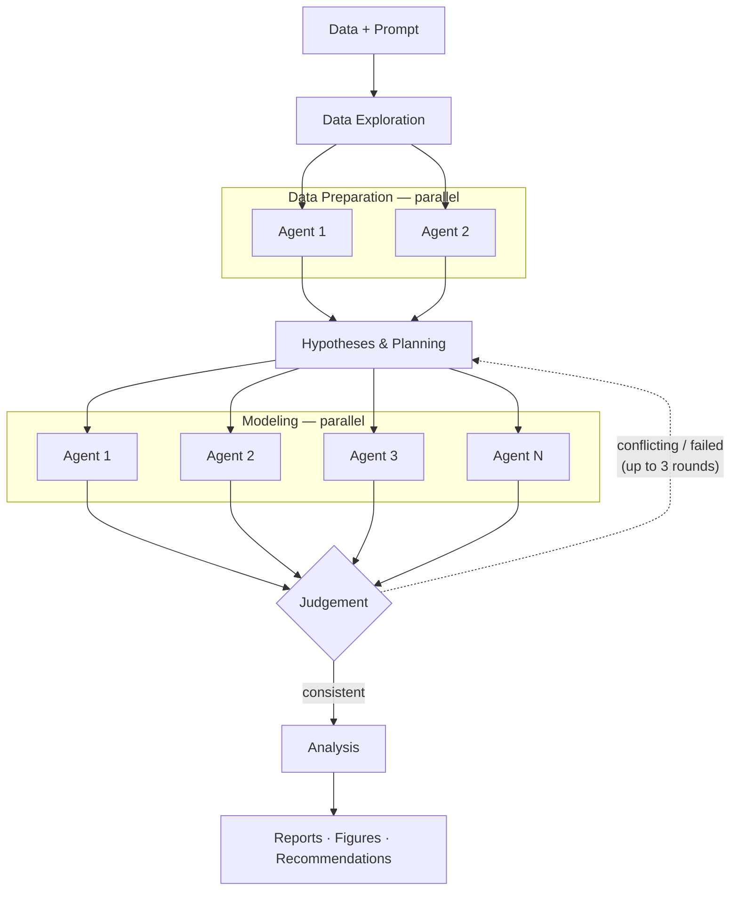

# MMM decision-pack

Automated Bayesian Marketing Mix Modeling with PyMC-Marketing, parallel subagents, and cloud MCMC.

## What it does

You give it marketing spend data and a business question. It runs an orchestrator that:

1. Spawns parallel data-preparer agents (different LLMs) to clean and validate the data
2. Creates multiple modeling plans with different priors, pooling strategies, and configurations
3. Spawns parallel modeler agents to fit each plan via cloud MCMC (Modal)
4. Checks whether the models agree — if they conflict, it stops and says so instead of making unsupported recommendations
5. If models agree, runs budget optimization scenarios and writes a report

The orchestrator retries up to 3 rounds if models don't converge, with increasingly simplified configurations. If even the simplest model fails, it reports that the data doesn't support inference and recommends experiments.



## Quick start

An example dataset is included in `example-data/`:

```bash
dlab \
  --dpack decision-packs/mmm \
  --data decision-packs/mmm/example-data/example_dataset.csv \
  --env-file .env \
  --work-dir ./mmm-example \
  --prompt "Analyze our marketing spend and recommend budget allocation"
```

### Example dataset ground truth

The example dataset is a synthetic 104-week, 3-channel dataset with known ground truth. Use it to verify the agent recovers correct values.

| Channel | True ROAS | Contribution (% of revenue) |
|---------|-----------|----------------------------|
| paid_search | 2.0 | 30.7% |
| social | 3.5 | 26.5% |
| email | 6.0 | 12.8% |

Revenue split: 20% baseline, 70% marketing, 10% controls.

The optimal budget reallocation shifts spend from paid_search (lowest ROAS) toward email and social (highest ROAS).

### Example run output

```
dlab · mmm-agent-oc · anthropic/claude-opus-4-5
Session:    /home/ubuntu/decision-lab/mmm-example

[1/4] Setting up environment
      Image: dlab-mmm (cached)
      Container started: mmm-example
[2/4] Pre-run hooks
      deploy_modal.sh
        Deploying Modal app...
        ✓ App deployed in 1.4s! 🎉
        Modal app deployed.
[3/4] Running agent ...
      ╭──────────────────── Monitoring ─────────────────────╮
      │ dlab connect ./mmm-example                          │
      │   Live-monitor the run                              │
      │                                                     │
      │ dlab timeline ./mmm-example                         │
      │   View execution timeline after the run             │
      ╰─────────────────────────────────────────────────────╯
[4/4] Cleanup
      Stopping container...
      Done.
```

A run on this dataset with Claude Opus takes ~19 minutes and costs ~$7. The agent:
- Spawns 2 parallel data-preparers (Sonnet + Gemini)
- Creates 4 modeling plans with different prior configurations
- Spawns 4 parallel modelers that fit on Modal
- Consolidates results, runs budget optimization at multiple risk levels
- Writes a business report and a technical report

```
main                                          |████░░░░░░░░░░░░░░██░░░░░░░░░░░░░░░░░░░░██████████| 19.4m
data-preparer .../instance-1                  |    █████████████                                  | 5.1m
data-preparer .../instance-2                  |    ██████                                         | 2.3m
modeler .../instance-1                        |                     █████████████                 | 5.3m
modeler .../instance-2                        |                     ██████████████                | 5.5m
modeler .../instance-3                        |                     ██████████████                | 5.6m
modeler .../instance-4                        |                     ████████████                  | 4.6m
modeler .../consolidator                      |                                   ████            | 1.7m
```

Recovered values vs ground truth:

| Channel | True ROAS | Agent ROAS | Error |
|---------|-----------|------------|-------|
| paid_search | 2.0 | 1.74 | -13% |
| social | 3.5 | 3.37 | -4% |
| email | 6.0 | 4.84 | -19% |

Channel ranking recovered correctly (email > social > paid_search). The agent correctly recommends shifting budget from paid_search to email and social.

## Environment variables

Create a `.env` file:

```bash
# Required for the LLM (one of these)
ANTHROPIC_API_KEY=sk-ant-...
# or OPENAI_API_KEY=sk-...

# Required for MCMC fitting (Modal cloud)
MODAL_TOKEN_ID=ak-...
MODAL_TOKEN_SECRET=as-...
```

Get Modal tokens at https://modal.com/settings/tokens.

### Local fitting (optional)

Models are fit on Modal by default. To fit locally instead (slower, no Modal credentials needed), set `DLAB_FIT_MODEL_LOCALLY=1` in your `.env` or pass it as an env var:

```bash
DLAB_FIT_MODEL_LOCALLY=1 dlab --dpack decision-packs/mmm --data ./data --prompt "..."
```

Local fitting runs at 1-2 it/s (PyTensor) or 3-8 it/s (numpyro). Modal runs at 5-10 it/s.

## Data requirements

Your CSV should have:

| Column type | Required | Description |
|-------------|----------|-------------|
| Date | Yes | Weekly or daily date column |
| Target | Yes | Revenue, sales, conversions — what you're modeling |
| Channel spend | Yes | Marketing spend per channel (TV, digital, radio, etc.) |
| Controls | No | Price, competitor activity, holidays, weather |
| Dimensions | No | Region, product line — for panel/hierarchical models |

## Agent architecture

```
orchestrator (primary)
├── data-preparer ×2 (parallel, different LLMs)
│   └── consolidator (auto, read-only)
├── modeler ×2-5 (parallel, different strategies)
│   └── consolidator (auto, read-only)
└── analyst (via task tool, post-modeling)
```

**orchestrator** — coordinates the workflow, creates modeling plans, evaluates consistency across models, runs budget optimization, writes reports.

**data-preparer** — cleans data, identifies columns, runs stationarity/seasonality/VIF analysis. Two instances with different LLMs (Sonnet + Gemini) for diversity.

**modeler** — configures and fits a PyMC-Marketing MMM with one specific strategy. Runs prior predictive checks, fits via Modal cloud MCMC, validates convergence. Reports diagnosis when things don't converge.

**analyst** — loads a fitted model, runs posterior predictive checks, computes ROAS with uncertainty, analyzes saturation curves, writes business insights.

## What makes this different from a vanilla coding agent

A vanilla coding agent fits one model in minutes, gives you a number, and moves on. This agent system:

- Tries multiple approaches in parallel and checks if they agree
- Refuses to recommend when models conflict (instead of adding caveats to bad advice)
- Reports uncertainty intervals, not point estimates
- Runs 13 hours and 11 modeling approaches on hard problems if that's what the data requires
- Says "the data doesn't support this inference" when it doesn't

## Directory structure

```
decision-packs/mmm/
├── config.yaml
├── deploy_modal.sh              # Pre-run hook: deploys Modal (skipped when local)
├── docker/
│   ├── Dockerfile
│   ├── mmm_lib/                 # Python library (data utils, model helpers)
│   └── modal_app/
│       └── mmm_sampler.py       # Serverless MCMC fitting
├── opencode/
│   ├── opencode.json
│   ├── agents/
│   │   ├── orchestrator.md
│   │   ├── data-preparer.md
│   │   ├── data-explorer.md
│   │   ├── modeler.md
│   │   └── analyst.md
│   ├── parallel_agents/
│   │   ├── data-preparer.yaml
│   │   └── modeler.yaml
│   ├── skills/                  # Domain knowledge
│   │   ├── pymc-marketing-mmm/
│   │   ├── distributions/
│   │   ├── informative-priors/
│   │   ├── samplers/
│   │   └── data/
│   └── tools/                   # Custom tools
└── tests/
```

## Testing

See [tests/README.md](tests/README.md).

```bash
# Local (no cloud)
cd decision-packs/mmm
pytest tests/test_pickle_workflow.py -v

# Modal integration
export MODAL_TOKEN_ID=... MODAL_TOKEN_SECRET=...
pytest tests/test_modal_integration.py -v -s
```

## Troubleshooting

**Modal not deploying** — check that `.env` has `MODAL_TOKEN_ID` and `MODAL_TOKEN_SECRET`, and that you're passing `--env-file .env`.

**Models disagree on ROAS** — this is the system working correctly. If ROAS varies >5x across models for the same channel, or models give opposite recommendations, the orchestrator stops. The data doesn't support a confident recommendation. The report will explain why and suggest experiments.

**All models fail to converge** — the data may not support MMM at this complexity. The orchestrator will try up to 3 rounds with progressively simpler configurations. If nothing works, the report explains what data or experiments are needed.
